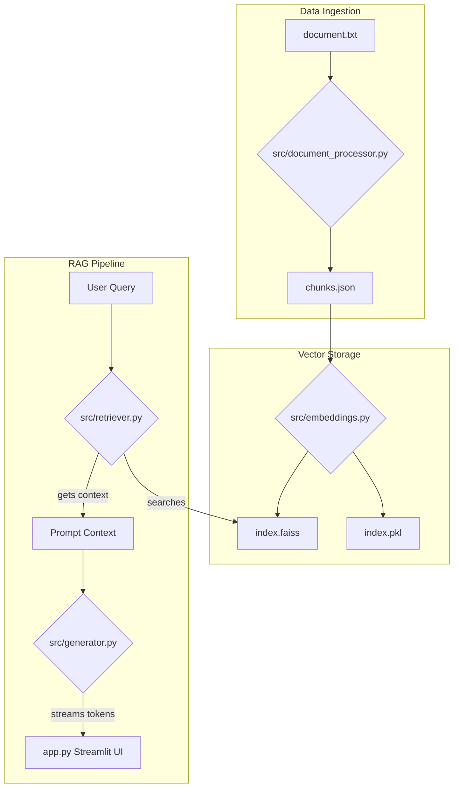

# 🤖 DataSphere RAG Chatbot

An AI-powered chatbot that provides grounded answers from a 10,500+ word legal document set using a **Retrieval-Augmented Generation (RAG)** pipeline. Featuring real-time streaming responses and a premium Streamlit interface.

---

## 🌟 Key Features

- **Semantic Search**: Powered by FAISS and `all-MiniLM-L6-v2` for high-precision retrieval.
- **RAG Pipeline**: Context-aware generation using **Mistral-7B** (via Ollama) or **HuggingFace Inference API**.
- **Real-Time Streaming**: Token-by-token response generation for a premium UX.
- **Dynamic PDF Upload**: Upload your own PDF documents on the fly via the sidebar. The app instantly extracts the text, chunks it, and builds a temporary in-memory FAISS index so you can start chatting with your specific file immediately.
- **Grounded Answers**: Strict prompt engineering ensures the AI only answers using provided context.
- **Source Transparency**: Displays the exact document chunks used for each answer with relevance scores.
- **Robust UI**: Modern dark-themed Streamlit interface with chat history, toggleable knowledge sources (Global KB vs Uploaded File), and sidebar controls.

---

## 🏗️ Architecture



---

## 🚀 Quick Start

### 1. Prerequisites
- Python 3.9+
- [Ollama](https://ollama.com/) (Recommended for local local execution)

### 2. Installation
```bash
git clone https://github.com/Nitishkumar2026/Rag-Chatbot.git
cd Rag-Chatbot
pip install -r requirements.txt
```

### 3. Setup Ollama (Optional but Recommended)
```bash
ollama serve
ollama pull mistral
```

### 4. Configure Environment
Create a `.env` file from the template:
```bash
cp .env.example .env
```
*If using HuggingFace fallback, add your `HF_API_TOKEN` to `.env`.*

### 5. Build the Knowledge Base
Run the preprocessing and embedding pipeline:
```bash
# 1. Clean & Chunk document
python src/document_processor.py

# 2. Generate embeddings & Build FAISS index
python src/embeddings.py
```

### 6. Launch the App
```bash
streamlit run app.py
```

---

## 📂 Project Structure

| Folder/File | Description |
| :--- | :--- |
| `data/` | Raw document source files (`document.txt`). |
| `chunks/` | Processed and chunked text segments in JSON format. |
| `vectordb/` | FAISS index and metadata for semantic search. |
| `notebooks/` | Jupyter notebooks for preprocessing and evaluation. |
| `src/` | Core logic modules (Retriever, Generator, Processor). |
| `app.py` | Main Streamlit application with streaming support. |
| `requirements.txt` | Project dependencies. |

---

## 🧪 Evaluation

Check out `notebooks/02_evaluation.ipynb` for a detailed analysis of:
- Chunking logic and sentence-aware splitting.
- Embedding model performance (`all-MiniLM-L6-v2`).
- 5+ Example queries (Success/Failure cases).
- Analysis of hallucinations and model limitations.

---

## 🛡️ License
This project is part of a technical assignment for **Amlgo Labs**. All code and logic are my own work.

---
*Developed by Nitish · Junior AI Engineer Assignment*
